# Tester avec Robot Framework
### 01-03 Octobre 2025
##### Nickel CHARENTON
###### Rémi PICARD

<br/>

###### Appuyer sur la barre d'ESPACE ou les flèches pour démarrer

---

## Tour de table

<v-clicks>

- Expérience testeur
- Expérience avec Robot Framework
- Expérience dev
- Attente vis à vis de cette formation ?

</v-clicks>

---
layout: two-cols
---

## Qui suis-je ?


<v-clicks>

- Rémi PICARD
- Dev Scala Cobalt
- 4 ans chez Nickel
- 4 ans d'expérience avec Robot Framework 🤖
- Passionné par les technos Web, Data et DevOps
- 13 ans d'expérience dans l'IT 👾
- Joueur d’échecs ♟

</v-clicks>

::right::


---
layout: center
---

# Découverte de Robot Framework

---
layout: center
---

## Robot Framework => "Robot"
### RF / RBF / RBT

---

## Plan

<v-clicks>

- Généralités
- Rappels Python
- Comprendre le fonctionnement de Robot
- Installer l'env de dev
- Apprendre le langage Robot
- Découvrir la ligne de commande `robot`
- Codelab Tests API
- Codelab Tests UI avec Playwright

</v-clicks>

---

## Présentation

<v-clicks>

- Outil d’automatisation
- Langage
- Open Source codé en Python
- Fonctionnalités clefs en main (assertions, rapport de tests…)
- Extensible via des librairies Robot Framework (HTTP, JSON, SQL, Kafka …)
- Extensible via des librairies Python

</v-clicks>

---

## Histoire
### 20 ans déjà !

```mermaid
timeline
2005 : Thèse (Pekka Klärck)
2008 : v2
: déployé chez Nokia
: Open Source
2015 : v3
: Robot Framework Foundation
2021 : v4
2022 : v5
: v6
2024 : v7
```



---

## Communauté

<v-clicks>

- Slack
- RoboCon / RBCN : conférence annuelle à Helsinki 🇫🇮
- [Documentation](https://docs.robotframework.org/docs)

</v-clicks>

---

## Pyramide des tests
### Tests End-To-End


<span style="font-size: 0.5rem;">Source : https://blog.takima.fr/saffranchir-de-la-pyramide-des-tests/</span>

---
layout: center
---

# Env de dev 💻

---

## Installation
### Python Virtual Environment

```mermaid
flowchart TD
    A[Poste 💻 avec Python 🐍]
    A --> B[Virtual Env With Robot]
    B --> |Dépendances| B1(robotframework)
    A --> C[Virtual Env With Backend]
    C --> |Dépendances| C1(fastapi)
```

<v-clicks>



[Python Virtual Environment](https://docs.robotframework.org/docs/getting_started/testing#install-robot-framework-in-a-virtual-environment)

</v-clicks>

---

## Installation
### Docker

```mermaid
flowchart TD
    A[Poste 💻 avec Docker 🐳]
    A --> B[Image Robot Framework]
    B --> |Dépendances| B1(robotframework)
```



---

## Installation
### PyCharm / VSCode

[Set up your IDE](https://docs.robotframework.org/docs/getting_started/ide)

---
layout: center
---

## Codelab 💻

- [Installation env de dév](https://remi-picard.github.io/robot-codelab/installation/)
- [Hello World](https://remi-picard.github.io/robot-codelab/hello-world/)
- [Configuration IDE](https://remi-picard.github.io/robot-codelab/configuration-ide/)

---
layout: center
---

# Développer avec Python 🐍
## Rappels

---

## Types natifs

<v-clicks>

| Type         | Mot-clé    | Exemple                              |
|--------------|------------|--------------------------------------|
| **Entier**   | `int`      | `42`, `-17`, `0`                     |
| **Flottant** | `float`    | `3.14`, `2.5e-3`                     |
| **Booléen**  | `bool`     | `True`, `False`                      |
| **Chaîne**   | `str`      | `"Hello"`, `'World'`                 |
| **Tableau**  | `list`     | `["Hello", "World"]`                 |
| **Map**      | `dict`     | `{"key": "value", "key2": "value2"}` |
| **Aucun**    | `NoneType` | `None`                               |

</v-clicks>

<v-clicks>

[Documentation](https://docs.python.org/fr/3.13/library/stdtypes.html)

</v-clicks>

---

## Méthodes

```python{1-3|1-3,5|1-3,6|1-3,7|1-3,8|1-3,9}
def ma_fonction(arg1: int, arg2: str, default_arg="default", *args, **kwargs) -> int:
    # ...
    return 42

ma_fonction(42, "Quarente-deux")
ma_fonction(42, "Quarente-deux", "override default value")
ma_fonction(42, "Quarente-deux", "default", 1, 2, 3)
ma_fonction(42, "Quarente-deux", "default", robot="Nono", john="Doe")
ma_fonction(42, "Quarente-deux", "default", 1, 2, 3, robot="Nono", john="Doe")
```


---
layout: center
---

# Développer avec Robot Framework 🤖
## Tests, Variables, Keyword, Python, Structure ...

---

## Tests

<v-clicks>

- fichier `*.robot`
- indentation comme en Python 🐍
- ensemble de phrases 🪄
- Section `*** Test Cases ***`
- Import librairies dans `*** Settings ***`

</v-clicks>

---

## Tests
### Déclaration

```text {1-2|4-|all}
*** Settings ***
Library     String

*** Test Cases ***
Mon Premier Test
    ${chaine}=    Generate Random String    10
    Log    Hello ${chaine}
```

---

## Variables

<v-clicks>

- Même types qu'en Python 🐍
- Syntaxe `${...}` (comme en Bash)
- Création dans un Test ou Keyword
- Création en global dans la section `*** Variables ***`
- Import des variables Python possible

</v-clicks>

---

## Variables
### Section Variables

<v-clicks>

```text {1-5|all}
*** Variables ***
${nombre}       42
${chaine}       Ma chaîne de caractères
@{tab}          1    2    3
&{map}          clef1=valeur1    clef2=valeur2

*** Test Cases ***
Teste Variables
    Log    nombre=${nombre}
    Log    chaine=${chaine}
    Log    tab=${tab}
    Log    map=${map}
```

[Variables](https://docs.robotframework.org/docs/variables)

</v-clicks>

---

## Variables
### Déclaration

```text{1-4|1,6-8|all}
*** Test Cases ***
Creation Variable
    ${ma_variable}    Set Variable    C3PO
    Log    ma_variable=${ma_variable}

    # Nouvelle syntaxe RF>=7.0
    VAR    ${ma_variable}    C3PO
    Log    ma_variable=${ma_variable}
```

---

## Variables
### Portée

<v-clicks>

- Local `${hi} =    Set Variable    Hello`
- Test `Set Test Variable  ${HI}  Hello`
- Suite `Set Suite Variable  ${HI}  Hello`
- Global `Set Global Variable  ${HI}  Hello`
- 💡Limiter au maximum la portée
- Nouvelle syntaxe (uniforme) : `VAR    ${variable}    scope=SUITE`

</v-clicks>

---

## Variables
### Syntaxe VAR

> It is recommended to use the VAR syntax introduced in Robot Framework 7.0 for creating variables in different scopes instead of the Set Global/Suite/Test/Local Variable keywords.

[BuiltIn](https://robotframework.org/robotframework/latest/libraries/BuiltIn.html#Set%20Variable)

---

## Variables
### Import YAML

<v-clicks>

- option `--variablefile` / `-V`
- `robot --variablefile conf/local.yaml tests/14-variablefile.robot`

</v-clicks>

---

## Variables
### Option CLI

<v-clicks>

- option `--variable` / `-v`
- `robot --variable env:LOCAL tests/14-variable.robot`

</v-clicks>

---

## Variables
### Import Python

```python
# resources/mes_variables_python.py
variable_python = 42
```

<br/>

<v-click>

```text {1,2|all}
*** Settings ***
Variables    resources/mes_variables_python.py

*** Test Cases ***
Utiliser Variable Python
    Log    variable_python=${variable_python}
```

</v-click>

---

## Variables
### ENV

- Syntaxe `%{VARIABLE_ENV=default_value}`

---

## Injection Python 🐍
### Evaluate

```text {1-4|6-8}
*** Test Cases ***
Teste Evaluate
    ${nb}=    Evaluate    41 + 1
    Log    nb=${nb}

Teste Evaluate Autre Syntaxe
    ${nb}=    Set Variable    ${{41 + 1}}
    Log    nb=${nb}
```

---

## Keyword
### Concept

<v-clicks>

- Ensemble de mots clés (séparés par 1 espace)
- Forme une phrase 🪄
- Représente une **action** 🕹️
- Déclaré dans la section `*** Keywords ***`
- Robot Framework traduit les phrases en appels Python 🐍

</v-clicks>

---

## Keyword
### Syntaxe Robot Framework

```text {1|1-3|1,5-7|1,9-12}
*** Keywords ***
Mon Premier Keyword
    Log    Hello World
    
Mon Premier Keyword Avec Argument
    [Arguments]    ${name}
    Log    Hello ${name}
    
Mon Premier Keyword Avec Argument Et Return
    [Arguments]    ${name}
    Log    Hello ${name}
    RETURN    42
```

---

## Keyword
### Arg dans Keyword

```text {1-3|1,5-7|all}
*** Keywords ***
Keyword Avec ${arg1} Intégré
    Log    Hello ${arg1}
    
Keyword Avec ${arg1} Intégré Et Arguments
    [Arguments]    ${name}
    Log    Hello ${arg1}, ${name}
    
*** Test Cases ***
Appel Keywords
    ${arg1}    Set Variable    Ma Variable
    Keyword Avec ${arg1} Intégré  
    Keyword Avec ${arg1} Intégré Et Arguments    Arg2
```

---

## Keyword
### List (args) / Dict (kwargs)

```text {1-6|1-6,14-18|1,8-12|1,8-12,14-15,20-23|all}
*** Keywords ***
Keyword Avec Args
    [Arguments]    @{list}
    FOR    ${i}    IN    @{list}
        Log    i=${i}
    END

Keyword Avec Kwargs
    [Arguments]    &{map}
    FOR    ${k}    ${v}    IN    &{map}
        Log    key=${k}, value=${v}
    END

*** Test Cases ***
Appel Keywords
    # ${list}    Create List    1    2    3
    VAR    @{list}    1    2    3
    Keyword Avec Args    ${list}

    # ${map}    Create Dictionary    cle1=valeur1    cle2=valeur2
    VAR    &{map}    cle1=valeur1    cle2=valeur2
    Keyword Avec Kwargs    &{map}
```

---

## Keyword
### Gestion des espaces

<v-clicks>

- **1 espace** entre chaque mot
- **2 espaces ou +** (ou **tabulation**) entre chaque argument

</v-clicks>

<br>

<v-click>


</v-click>

---

## Keyword
### Gestion des chaînes

- inutile de mettre des `"` ou des `'` autour des chaînes de caractère

---

## Keyword
### Appel

```text {1|1-3|1-2,4|1-2,5|7-9}
*** Test Cases ***
Mon Premier Test
    Mon Premier Keyword
    Mon Premier Keyword Avec Argument    Nono le petit robot
    ${retour}=    Mon Premier Keyword Avec Argument Et Return    Terminator

*** Keywords ***
Mon Deuxième Keyword
    Mon Premier Keyword
```

---

## Keyword
### Syntaxe Python

<v-clicks>

```python {1-4|6-9}
# mon_keyword.py
# Mon Premier Keyword
def mon_premier_keyword():
    print("Hello World")
    
# ${retour}=    Mon Premier Keyword Avec Argument Et Return    ${name}
def mon_premier_keyword_avec_argument_et_return(name) -> int:
    print(name)
    return 42
```

```
*** Settings ***
Library    mon_keyword.py

*** Test Cases ***
Mon Test
    Mon Premier Keyword
    ${retour}=    Mon Premier Keyword Avec Argument Et Return    R2D2
```

</v-clicks>

---

## Test -> Keyword -> Keyword

```mermaid
graph TD
    A["Test Case: Mon Test (.robot)"] --> B("Keyword: Mon Premier Keyword")
    B --> C("Keyword Python 🐍: mon_premier_keyword")
    A --> D("Keyword: Un Autre Keyword")
    D --> E("Keyword 🤖(BuiltIn): Log")
```

<br>



---

## Sections

<v-clicks>

- `*** Settings ***` : imports librairies / ressources / variables
- `*** Test Cases ***` : déclarations Tests
- `*** Keywords ***` : déclarations Keywords
- `*** Variables ***` : déclarations Variables

</v-clicks>

---

## Structures

<v-clicks>

- boucle `FOR`
- boucle `WHILE`
- condition `IF` / `ELSE`
- gestion erreur `TRY` / `EXCEPT`
- [Control structures](https://robotframework.org/robotframework/latest/RobotFrameworkUserGuide.html#control-structures)

</v-clicks>

---

## Ligne de commande `robot`

```bash {1|3-4|6-7|all}
robot --help

# Lance tous les tests présents dans le dossier tests
robot tests

# Lance le test "Mon Test"
robot -t "Mon Test" tests
```

---

## Résultats

<v-clicks>

- `log.html` : détails par tests et keywords
  - 🔴 ERROR => automatiquement affiché (avec focus sur le keyword en erreur)
  - 🟢 SUCCESS
- `output.xml` / `xunit.xml` : sortie technique pour intégration continue / outils

</v-clicks>

---

## Résultats
### log.html


---
layout: center
---

## Quizz

[Lien ou passer à la slide suivante](https://forms.gle/KBcDj1j1GjBkdzM47)

---
layout: iframe
url: https://docs.google.com/forms/d/e/1FAIpQLSc655WK-rOylFx33U_66B-3E1YV6lGbbEhw3Amm6SA2m2w3jQ/viewform?usp=header
---

---
layout: center
---

## TP Keyword 💻

Tester les syntaxes

- Keywords
- Tests
- Variables

---

## Requests Library

<v-clicks>

- Tests d'API
- Wrapper de la lib Python requests
- [Documentation](https://docs.robotframework.org/docs/different_libraries/requests)
- Manipulation JSON simple

</v-clicks>

---

## Requests Library

```bash
pip install robotframework-requests
```

---

## Requests Library

```text {1-2|-6|1-2,8-9|1-2,11-13|1-2,15-|all}
*** Settings ***
Library     RequestsLibrary

*** Test Cases ***
Quick Get Request Test
    ${response}    GET    https://www.google.com

Quick Get Request With Parameters Test
    ${response}    GET    https://www.google.com/search    params=query=ciao    expected_status=200

Quick Get A JSON Body Test
    ${response}    GET    https://jsonplaceholder.typicode.com/posts/1
    Should Be Equal As Strings    1    ${response.json()}[id]

Create Booking
    ${booking_dates}    Create Dictionary    checkin=2022-12-31    checkout=2023-01-01
    ${body}    Create Dictionary
    ...    firstname=Hans
    ...    lastname=Gruber
    ...    totalprice=200
    ...    depositpaid=false
    ...    bookingdates=${booking_dates}
    ${response}    POST    url=https://restful-booker.herokuapp.com/booking    json=${body}
    ${id}    Set Variable    ${response.json()}[bookingid]
```

---
layout: center
---

## Codelab 💻

[API Booker](https://remi-picard.github.io/robot-codelab/api-booker/)

---

## Browser Library

<v-clicks>

- Tests UI
- Wrapper de [Playwright](https://playwright.dev/)
- [Documentation](https://docs.robotframework.org/docs/different_libraries/browser)
- [Keywords](https://marketsquare.github.io/robotframework-browser/Browser.html)
- [Exemples / Comparaison](https://robotframework-browser.org/#examples)

</v-clicks>

---

## Browser Library

<v-clicks>

- Rapide 🚀
- Fiable ✅
- Contrôle du navigateur 🧑‍✈️
- Remplaçant de [Selenium Library](https://docs.robotframework.org/docs/different_libraries/selenium)

</v-clicks>

---

## Browser Library

```bash {1|3|5-6|8-9|11-13|all}
# Installer Node https://nodejs.org/en/download/

pip install robotframework-browser

# Télécharge le navigateur
rfbrowser init

# Télécharge le navigateur Firefox
rfbrowser init firefox
```

---

## Browser Library

```text {1-2|1-5|1-7|1-11|all}
*** Settings ***
Library     Browser

*** Test Cases ***
Go To Playwright With Browser Library
    # Opens a new browser instance. Use this keyword for quick experiments or debugging sessions.
    Open Browser
    
    New Page    https://playwright.dev/
    Get Title    contains    Playwright
    Take Screenshot
    
    Click    a >> "Get started"
    Get Element States    h1 >> "Installation"    contains    visible
    Take Screenshot
```

---
layout: center
---


---

## Browser Library
### Ralentir le navigateur

```
Ralentir Browser
    # Remplacer `Open Browser` par `New Browser`
    New Browser    browser=firefox    headless=${False}    slowMo=1 second
```

---

## Sélecteurs

<v-clicks>

- CSS (type selector => `input`, `div`...)
- CSS (id selector => `#todo-input`)
- CSS (class selector => `.todo-list`)
- [CSS Selector Reference](https://www.w3schools.com/cssref/css_selectors.php)
- [CSS Selector Tester](https://www.w3schools.com/cssref/trysel.php)
- XPATH (`//*[@id="todo-input"]`)
- [XPath Syntax](https://www.w3schools.com/xml/xpath_syntax.asp)

</v-clicks>

---

## Selecteurs
### DevTools Elements


---

## Selecteurs
### DevTools Elements


---

## Selecteurs
### DevTools Console

<v-clicks>

- `$$` ou `document.querySelectorAll` pour tester les sélecteurs


</v-clicks>

---

## Récupérer un champ HTML

<v-clicks>

- `${element}    Get Element    css=.new-todo`
- `${element}    Get Element    id=todo-input`
- `${element}    Get Element    text=todos`
- `${element}    Get Element    xpath=//*h1`

</v-clicks>

---
layout: center
---

## Codelab 💻

[TODO MVC](https://remi-picard.github.io/robot-codelab/todo-mvc/)

---
layout: center
---

# Bonnes pratiques et Industrialisation

---

## Plan

<v-clicks>

- Organiser les tests et les ressources
- Utiliser les librairies standards de Robot Framework
- Découvrir les syntaxes avancées
- Ecrire des tests robustes
- Découvrir les outils autour de Robot Framework
- Mettre en place une intégration continue

</v-clicks>

---

## Organiser les tests et les ressources
### Structure standard d'un projet

<v-clicks>

- `tests/` : fichiers de tests (`.robot`) et suite de tests
- `resources/` : keywords partagés, variables et librairies maison (`.resource`, `.py`)

</v-clicks>

<br>

<v-clicks>

```text
mon-projet/
├── tests/
│   └── cas_de_test.robot
│   └── suite/
│       └── autre_cas_de_test.robot
├── resources/
│   └── keyword_communs.resource
│   └── ma_librairie.py
```

</v-clicks>

<br>

<v-clicks>

[RobotFramework - Project Structure](https://docs.robotframework.org/docs/examples/project_structure)

</v-clicks>

---
layout: center
---

# Syntaxes avancées 🖋️

---

## Test Template

```text {10-|1-4,10-|1,5-|all}
*** Test Cases ***
Normal test case with embedded arguments
    The result of 1 + 1 should be 2
    The result of 1 + 2 should be 3

Template with embedded arguments
    [Template]    The result of ${calculation} should be ${expected}
    1 + 1    2
    1 + 2    3

*** Keywords ***
The result of ${calculation} should be ${expected}
    ${result} =    Evaluate    ${calculation}
    Should Be Equal As Strings    ${result}    ${expected}
```

- [Test Templates](https://robotframework.org/robotframework/latest/RobotFrameworkUserGuide.html#test-templates)

---

## Test
### Before / After

<v-clicks>

- `Test Setup`
- `Test Teardown`
- [Test setup and teardown](https://robotframework.org/robotframework/latest/RobotFrameworkUserGuide.html#test-setup-and-teardown)

</v-clicks>

---

## Behavior Driven Development (BDD)
### Syntaxe Given-When-Then

```text {7-|all}
*** Test Cases ***
Mon Test Bdd
    Given Pré Requis
    When Action
    Then Verifications

*** Keywords ***
Pré Requis
    Log    Pré Requis

Action
    Log    Action

Verifications
    Log    Verifications
```

[BDD](https://docs.robotframework.org/docs/testcase_styles/bdd)

---
layout: center
---


---
layout: center
---

# Utiliser les librairies standards 🪛

---

## Standard Library

<v-clicks>

- Inclus avec Robot Framework Core
- BuiltIn (importé automatiquement)
- String
- Collections
- DateTime
- [OperatingSystem](https://robotframework.org/robotframework/latest/libraries/OperatingSystem.html)
- Screenshot
- Process
- XML
- [Standard Library](https://docs.robotframework.org/docs/different_libraries/standard)

</v-clicks>

---

## Standard Library
### Import

```text
*** Settings ***
Library  Collections
Library  OperatingSystem
Library  Process
Library  String
```

---

## BuiltIn

```text {1-8|1-2,10-|all}
*** Test Cases ***
Some Assertions
    ${var}=    Set Variable    1.0
    Should Not Be Equal    1    ${var}
    Should Be Equal As Numbers    1    ${var}
    Should Be Equal As Strings    1.0    ${var}
    Should Be True    ${var} == 1.0
    Should Not Be True    ${var} > 10

    ${string}=    Set Variable    My String
    Should Start With    ${string}    My
    Length Should Be    ${string}    9
```

---
layout: center
---

# Gestion des fichiers 🗂️

---

## Fichier Template

- [Templates Jinja2](https://blog.stephane-robert.info/docs/developper/programmation/python/jinja/)
- Création contenu de fichiers
- Couplé à `OperatingSystem`

---

## Fichier Template

<v-clicks>

<section>

- Template Jinja2 `templates/mon_template.csv.j2`

```csv
entete1;entete2

CONSTANTE;{{ d.variable }}

```

</section>


<section>

- Utilisation dans Keyword Python

```python
from jinja2 import Environment, FileSystemLoader

# Initialiser l'environnement avec un dossier de templates
env = Environment(loader=FileSystemLoader("templates"))
template = env.get_template("mon_template.csv.j2")


def charger_template(data):
    contenu = template.render(data=data)
    return contenu
```
</section>

</v-clicks>

---

## Fichier Template

<section>

- Utilisation dans Robot Framework

```text {1-3,12-|4-11|all}
*** Settings ***
Library     OperatingSystem
Library     resources/file_helper.py

*** Test Cases ***
Creer Fichier Avec Un Template
    ${ligne1}    Create Dictionary    variable=Ligne 1
    ${ligne2}    Create Dictionary    variable=Ligne 2
    ${data}    Create List    ${ligne1}    ${ligne2}
    Creer Fichier    data/output/mon_fichier.csv    ${data}

*** Keywords ***
Creer Fichier
    [Arguments]    ${path}    ${data}
    ${contenu}    Charger Template    ${data}
    ${fichier}    Create File    ${path}    ${contenu}
    ${contenu}    Get File    ${path}
    Log    ${contenu}
```
</section>

---

## Fichier Template

```csv
entete1;entete2
CONSTANTE;Ligne 1
CONSTANTE;Ligne 2
```

---
layout: center
---

## TP Fichiers 💻

- Créer et remplir un fichier
- Récupérer le fichier
- Déplacer le fichier
- Supprimer le fichier

---
layout: center
---

# Autres Librairies / Outils 🛠️

---

## Autres Librairies

<v-clicks>

- Requests Library
- Browser Library
- [Database](https://marketsquare.github.io/Robotframework-Database-Library/)
- [JSON](https://robotframework-thailand.github.io/robotframework-jsonlibrary/JSONLibrary.html)
- [Kafka](https://robooo.github.io/robotframework-ConfluentKafkaLibrary/)
- [DataDriver](https://docs.robotframework.org/docs/testcase_styles/datadriven)

</v-clicks>

---

## DataDriver

- JSON, CSV ou Excel => Données de tests
- `pip install robotframework-datadriver`

---

## PaBot

<v-clicks>

- Lancement des tests en parallèle 🚀
- ⚠️ Isolation des tests
- CLI `pabot` wrapper de `robot` (même options)
- `pip install robotframework-pabot`
- [PaBot](https://docs.robotframework.org/docs/parallel)

</v-clicks>

---

## MockServer

<v-clicks>

- L'API à tester a besoin d'un service externe
- Le service externe n'est pas disponible sur l'env de test
- MockServer remplace le service externe
- MockServer configurable par API

</v-clicks>

---

## MockServer
### API dépend de API Externe

```mermaid { mirrorActors: false }
sequenceDiagram
    participant Client
    participant API
    participant API Externe
    Client->>+API: 1.Appel
    API->>+API Externe: 2.Appel API Externe
    API->>-Client: 3.Réponse
```



---

## MockServer
### Flow de TEST


---
layout: center
---

# Ligne de commande 🕹️

---

## Ligne de commande `robot`

```bash {1-2|4-5|all}
# Vérifie la syntaxe de tous les tests
robot --dryrun tests

# Ajoute le répertoire courant dans le PYTHON PATH
robot --pythonpath . tests
```

<!-- Lien vers documentation officielle -->

---

## PYTHON_PATH

<v-clicks>

<section>

Sans `--pythonpath` :

```text
*** Settings ***
Resource    ../resources/ma_lib.resource

*** Test Cases ***
Tester Ma Lib
    Mon Keyword
```

</section>

<section>

Avec `--pythonpath .` ou `-P .` :

```text
*** Settings ***
Resource    resources/ma_lib.resource

*** Test Cases ***
Tester Ma Lib
    Mon Keyword
```

</section>

</v-clicks>

---

## Ligne de commande `robocop`

<v-clicks>

- `robocop check` (Linter)

```text
tests/22-failed-test.robot:8:5 ERR13 Invalid IF syntax: IF must have closing END
   |
 6 |
 7 | Test Lint En Erreur
 8 |     IF
   |     ^^ ERR13
 9 |         Log  IF
   |
```

</v-clicks>

---

## API Python

<v-clicks>

- Lancement `robot`
- Réflexion Tests / Keywords (métadonnées, hooks)
- Parsing des résultats en Python

</v-clicks>

---

## API Python

```python
import robot

def run_tests():
  robot.run("tests", outputdir="data", loglevel="TRACE")
```

---

## Pattern Visitor

```python {1-9|all}
from robot.running import TestSuiteBuilder
from robot.model import SuiteVisitor

class TagsOnTestCasesFinder(SuiteVisitor):
    def __init__(self):
        self.tests = list()

    def visit_test(self, test):
        self.tests.append(test.name)

def list_tests():
    builder = TestSuiteBuilder()
    testsuite = builder.build("tests/")
    finder = TagsOnTestCasesFinder()
    testsuite.visit(finder)
    for test in sorted(finder.tests):
        print(test)

if __name__ == "__main__":
    list_tests()
```

---

## Listener

<v-clicks>

- Mécanisme d'envoi de notifications
- Inspection / Modification de données
- Lors de l'exécution d'un test
- Lors de l'exécution d'un keyword
- Lors de l'écriture des rapports
- `--listener`
- [Documentation Listener](https://robotframework.org/robotframework/latest/RobotFrameworkUserGuide.html#listener-interface)

</v-clicks>

---

## Listener
### Exemple

<v-clicks>

```python
"""Listener that stops execution if a test fails."""
from robot.api import logger

ROBOT_LISTENER_API_VERSION = 2

def end_test(name, attrs):
    if attrs["status"] == "FAIL":
        logger.warn(f"Test '{name}' failed: {attrs['message']}")
        input("Press enter to continue.")
```

`robot --listener resources/pause_listener.py tests/22-failed-test.robot`

</v-clicks>

---
layout: center
---

# Bonnes pratiques 🥷

---

## Composition de Keywords

<v-clicks>

- Passer en argument un Keyword à un Keyword
- Equivalent à passer une lambda ou un callback à une méthode Python 🐍
- `Run Keyword`
- `Run Keyword If`
- `Wait Until Keyword Succeeds`

</v-clicks>

---

## Logs
### Niveaux

<v-clicks>

- 🟢 TRACE : niveau le plus fin (ex : détails requête HTTP)
- 🟢 DEBUG : trace de debug
- 🟢 INFO : par défaut
- 🟠 WARN : avertissement erreur non bloquante
- 🔴 ERROR : erreur bloquante (le test s'arrête)

</v-clicks>

---

## Logs
### Définir niveau

<v-clicks>

```bash
# Augmente le niveau de logs à TRACE
robot --loglevel TRACE . tests

# Augmente le niveau à TRACE mais affiche par défaut en INFO
robot -L TRACE:INFO . tests
```


</v-clicks>

---

## Logs
### Keyword Python

```python
from robot.api import logger

def log_from_python():
    logger.info("Hello From Python Keyword")
```

---

## Correlation ID

<v-clicks>

- Remplir Header `X-Request-ID`
- Pousser logs Robot dans Grafana
- Suivre logs des tests et applicatifs

</v-clicks>

---

## Nommage / Découpage

<v-clicks>

- Rester générique
- Factoriser
- Donner des noms métier si possible

</v-clicks>

---

## Documenter

<v-clicks>

- Bon nommage peut être suffisant 
- Documenter les passages importants (non triviaux)

</v-clicks>

---

## Structures avancées

<v-clicks>

- Tuple
- class
- dataclass (immutable)
- list-comprehension

</v-clicks>

---

## Tuple

```text{10-|all}
*** Test Cases ***
Teste Les Tuples
    ${robots}=    Get Robots
    Log    ${robots}
    ${robots_type}=    Evaluate    type($robots)
    Log    ${robots_type}
    Log    ${robots[0]}
    Log    ${robots[1]}

*** Keywords ***
Get Robots
    ${robots}=    Evaluate    ("R2D2", "C3PO")
    RETURN    ${robots}
```

---

## Dataclass

```python {1-4|all}
@dataclass
class ImmutableRobot:
    name: str
    color: str
    
# ${r2d2}=    Build Immutable Robot  R2D2  Bleue
# Log  ${r2d2.color}
def build_immutable_robot(name: str, color: str):
    return ImmutableRobot(name, color)
```

---

## List Comprehension

```text
*** Settings ***
Library     resources/robot_helper.py


*** Test Cases ***
Teste List Comprehension
    ${c3po}=    Build Immutable Robot    C3PO    Jaune
    ${r2d2}=    Build Immutable Robot    R2D2    Bleue

    ${robots}=    Create List    ${c3po}    ${r2d2}

    # Utilisez $robots (pas ${robots}) dans les expressions Python
    ${robots_jaunes}=    Evaluate    [r for r in $robots if r.color == "Jaune"]
```

---

## Lire la documentation

<v-clicks>

- Guide
- Keyword

</v-clicks>

<v-clicks>


</v-clicks>

---

## Formatteurs de code

<v-clicks>

- Robocop : Robot 🤖
- Black : Python 🐍
- Pre Commit (avant chaque commit Git)
- Vérification sur l'intégration continue

</v-clicks>

---

## Terminal interactif

<v-clicks>

- fzf (fuzzy finder)
- Pattern Visitor

</v-clicks>

---

## Terminal interactif

<video class="mt-3 m-auto" controls width="600">
  <source src="/images/interactive_terminal.mov" />
</video>

---

## Gérer l'asynchronisme

<v-clicks>

- Pas de `Sleep` (attente fixe fragile et qui ralentit les tests)
- Utiliser boucle d'attente `Wait Until Keyword Succeeds`
- Utiliser `[Timeout]` sur Keyword / Test
- [Documentation Timeout](https://robotframework.org/robotframework/latest/RobotFrameworkUserGuide.html#user-keyword-timeout)
- Utiliser les bons outils (`Playwright` attend par design)

</v-clicks>

<br>

<v-click>

```text
*** Test Cases ***
Attendre Creation Fichier
    Démarrer Batch
    Wait Until Keyword Succeeds    2x    1s    File Should Exist    path=output.txt
    ${fichier}    Get File    path=output.txt
    # ... Assertion sur le fichier

*** Keywords ***
Démarrer Batch
    Log    Start Batch
```

</v-click>

---
layout: center
---


---

## Gérer les erreurs

<v-clicks>

- Tenter des retry avec `Wait Until Keyword Succeeds`
- Gérer les erreurs avec [TRY/EXCEPT](https://robotframework.org/robotframework/latest/RobotFrameworkUserGuide.html#try-except-syntax)
- `Fail` un test si nécessaire
- `Log` (WARN / ERROR)

</v-clicks>

---
layout: center
---

# Rendre plus lisible le rapport HTML

---

## Suite

<v-clicks>

- Chaque fichier robot est une suite
- Les dossiers contenant les fichiers robot sont des suites
- Stats par suite

</v-clicks>

---

## Tag

<v-clicks>

- Les tests peuvent être taggués
- Options CLI `--include` / `--exclude` pour filtrer
- Stats par tag

</v-clicks>

---

## Log

<v-clicks>

- Ne pas TROP logguer
- Logguer du HTML (tableau) `Log  html=${True}`

</v-clicks>

---

## Remove Keywords

```bash
# WUKS = Wait Until Keyword Succeeds
robot --removekeywords PASSED --removekeywords WUKS tests/17-remove_keywords.robot
```

---

## Remove Keywords


---

## Flatten Keywords

```bash
robot --flattenkeywords ITERATION tests/18-flatten_keywords.robot
```

---

## Flatten Keywords


---

## rebot

- Filtre les rapports de sortie

---

## Structure GROUP

```text
*** Test Cases ***
Mon Test Avec Groupes
    GROUP    Groupement de 2 Keywords
        Premier Keyword
        Deuxieme Keyword
    END
    Troisieme Keyword
    Quatrieme Keyword

*** Keywords ***
Premier Keyword
    Log    Keyword1

Deuxieme Keyword
    Log    Keyword2

Troisieme Keyword
    Log    Keyword3

Quatrieme Keyword
    GROUP    Groupe dans un Keyword
        Log    Keyword4
        Log    Keyword4bis
    END
```

---

## GROUP


---
layout: center
---

# Intégration continue 👾️

---

## Docker 🐳

<v-clicks>

- Utiliser ou Builder une image Docker
- [Docker Images for Robot Framework](https://docs.robotframework.org/docs/using_rf_in_ci_systems/docker)

</v-clicks>

---

## Github Actions


[CI Systems / GitHub Actions](https://docs.robotframework.org/docs/using_rf_in_ci_systems/ci/github-actions)

---

## Intégration continue

<v-clicks>

- A chaque `push`
- Installer env python 
- OU charger image Docker (évite de réinstaller les dépendances)
- Exécuter dry-run
- 💡 Ne pas lancer les tests

</v-clicks>

---

## Tests quotidiens

<v-clicks>

- Chaque nuit
- Installer env python
- OU charger image Docker (évite de réinstaller les dépendances)
- Lancer les tests
- Publier les rapports HTML
- Effectuer un diff avec jours passés
- Notifier équipe

</v-clicks>

---

## Tests quotidiens
### Lancement via CI

<v-clicks>

- 🟢 Standard
- 🟠 Ouvertures de flux (https, bases, sftp...)
- 🟠 Publier les reports
- 🟠 https

</v-clicks>

---

## Tests quotidiens
### Outils de Reporting

<v-clicks>

- [Allure](https://docs.robotframework.org/docs/reporting_test_results/allure)
- [Report Portal](https://docs.robotframework.org/docs/reporting_test_results/report_portal)
- [Grafana](https://docs.robotframework.org/docs/reporting_test_results/grafana)
- [Robot Framework Metrics](https://docs.robotframework.org/docs/reporting_test_results/robot_framework_metrics)
- [Robot Framework Dashboard](https://docs.robotframework.org/docs/reporting_test_results/robot_framework_dashboard)

</v-clicks>

---

## Tests quotidiens
### Lancement via K8S / API


---

## Tests quotidiens
### Lancement via  K8S / API

<v-clicks>

- 🟢 File System Commun (input / output des apps, + report)
- 🟢 Lancement unitaire
- 🟢 http

</v-clicks>

---

## Tests quotidiens
### Robotdiff

<v-clicks>


[Robotdiff](https://robotframework.org/robotframework/2.1.2/tools/robotdiff.html)

</v-clicks>

---

## Tests quotidiens
### Notifications (GChat / Slack)

<v-clicks>

- Notifier **SI erreurs en +** par rapport à la veille


</v-clicks>

---
layout: center
---

# Autres Usages 👩🏻‍💻

---

## Usage Testeur

<v-clicks>

- Création de jeu données
- Tests semi-manuels

</v-clicks>


---
layout: center
---

# Collaborer 🛗

---

## Toolkit
### Partager une partie du code

<v-clicks>

- Keywords
- Helpers

</v-clicks>

---

## Portail Documentaire

<v-clicks>

- `libdoc` : documentation Keywords
- `libtoc` : Sidebar Keywords
- `testdoc` : documentation tests

</v-clicks>

---

## libdoc + libtoc


---

## testdoc


---

## Robotic Process Automation (RPA)

> Robotic Process Automation (RPA) **is similar to test automation on the technical level**,
> but the mentality is different on the business and results side.
> In RPA, it is pretty standard that you are not running on a machine you control entirely,
> so your robot needs to be "self-sufficient" and isolated.
> Also, instead of finding and documenting places where robot execution fails or succeeds,
> **the aim is always to succeed and get the result of the process**.

<v-clicks>

- `*** Test Cases ***` => `*** Tasks ***`
- [Librairies RPA (Desktop, Cloud, Scrapping...)](https://github.com/robocorp/rpaframework/?tab=readme-ov-file#libraries)

</v-clicks>

---
layout: center
---

## Codelab 💻

[Jeu RPA](https://remi-picard.github.io/robot-codelab/robot-flower-princess/)

---
layout: center
---

# IA 🤖

---

## IA
### Avantages

<v-clicks>

- Apprendre
- Prototyper
- Résoudre problématique spécifique

</v-clicks>

---

## IA
### Avertissements

<v-clicks>

- Prendre du recul
- Perte de contrôle
- Empreinte écologique

</v-clicks>

---

## Démo Génération de code

<v-clicks>

- Claude AI (Web)
- Gemini (CLI)

</v-clicks>

---
layout: center
---

# Récap 🤯

---

## Keywords / Phrases


---

## Structure projet


---

## Librairies Core


---

## Librairies


---

## Ecosystème

```mermaid
mindmap
  root((Robot<br/>Framework))
    CLI robot
        Reports
    API Python
    Docker
    IDE
    IA
    Communauté
    Python
    MockServer
```



---

## Bonnes pratiques


---

## test-automation VS RPA


---
layout: center
---

# Rétro 🛋️

---
layout: center
---

# Questions & Réponses

<v-clicks>

- Merci pour votre attention. 🙏
- Bonne chance pour l'automatisation de vos tests !
- Amusez-vous bien !

</v-clicks>
